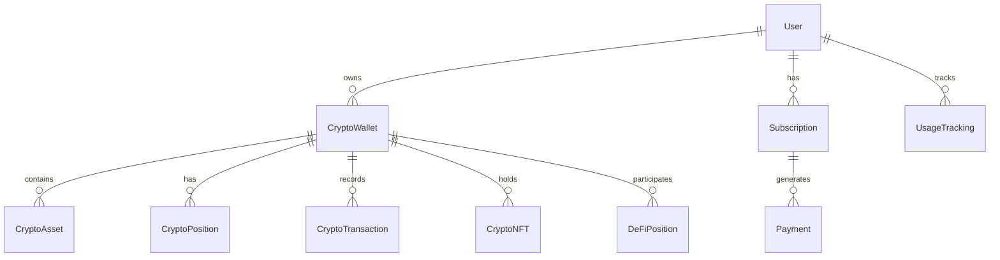

# Mappr Backend - Frontend Integration Guide

## Overview

Mappr is a comprehensive financial management platform offering traditional banking integration and cryptocurrency portfolio management. This documentation provides all the information needed for frontend developers to integrate with the API effectively.

**Base URL**: `http://localhost:3000/api/v1`
**Authentication**: Bearer Token (JWT)

## 🔐 Authentication System

### Better Auth Integration

The backend uses Better Auth for comprehensive authentication management with enhanced security features.

#### Authentication Endpoints

**Base Path**: `/api/auth/*` (handled by Better Auth)

Key endpoints:
- `POST /api/auth/sign-up` - User registration
- `POST /api/auth/sign-in` - User login
- `POST /api/auth/sign-out` - User logout
- `GET /api/auth/session` - Get current session
- `POST /api/auth/forget-password` - Request password reset
- `POST /api/auth/reset-password` - Reset password
- `POST /api/auth/verify-email` - Verify email address

#### Session Management

```typescript
interface SessionResponse {
  success: boolean;
  data: {
    user: User;
    session: Session;
  };
}

interface User {
  id: string;
  email: string;
  firstName: string;
  lastName: string;
  role: 'USER' | 'ADMIN' | 'PREMIUM';
  currentPlan: 'FREE' | 'PRO' | 'ULTIMATE';
  status: 'ACTIVE' | 'INACTIVE' | 'SUSPENDED' | 'PENDING_VERIFICATION';
  emailVerified: boolean;
  profilePicture?: string;
  phone?: string;
  dateOfBirth?: string;
  monthlyIncome?: number;
  currency: string;
  timezone: string;
  createdAt: string;
  updatedAt: string;
}
```

#### Authentication Headers

```javascript
// For authenticated requests
headers: {
  'Authorization': 'Bearer <access_token>',
  'Content-Type': 'application/json'
}
```

## 📊 API Response Structure

### Standard Success Response

```typescript
interface ApiSuccessResponse<T = any> {
  success: true;
  data: T;
  message?: string;
  pagination?: {
    page: number;
    limit: number;
    total: number;
    totalPages: number;
  };
}
```

### Standard Error Response

```typescript
interface ApiErrorResponse {
  success: false;
  error: {
    code: string;
    message: string;
    details?: any;
  };
}
```

## 👤 User Management API

### Get Current User Session
```http
GET /session
Authorization: Bearer <token>
```

### Get User Profile
```http
GET /profile
Authorization: Bearer <token>
```

### Update User Profile
```http
PATCH /profile
Authorization: Bearer <token>
Content-Type: application/json

{
  "firstName": "John",
  "lastName": "Doe",
  "phone": "+1234567890",
  "dateOfBirth": "1990-01-01T00:00:00Z",
  "monthlyIncome": 5000.00,
  "currency": "USD",
  "timezone": "America/New_York",
  "profilePicture": "https://example.com/avatar.jpg"
}
```

### Get User Statistics
```http
GET /stats
Authorization: Bearer <token>
```

Response:
```typescript
{
  success: true,
  data: {
    accounts: number;
    transactions: number;
    categories: number;
    budgets: number;
    goals: number;
    currentPlan: 'FREE' | 'PRO' | 'ULTIMATE';
  }
}
```

### Delete User Account
```http
DELETE /account
Authorization: Bearer <token>
```

## 💰 Cryptocurrency Portfolio API

### Base Path: `/crypto`

#### Rate Limiting
- General API: 100 requests per 15 minutes
- Write operations: 10 requests per minute
- Sync operations: 3 requests per 5 minutes

### Wallet Management

#### Add Crypto Wallet
```http
POST /crypto/wallets
Authorization: Bearer <token>
Content-Type: application/json

{
  "name": "My MetaMask Wallet",
  "address": "0x742d35Cc6673C4532E4C6F5d72c4c2E2B9f1e4A7",
  "type": "HOT_WALLET",
  "network": "ETHEREUM",
  "label": "Trading Wallet",
  "notes": "Main trading wallet for DeFi",
  "tags": ["trading", "defi"]
}
```

#### Get User Wallets
```http
GET /crypto/wallets
Authorization: Bearer <token>
```

Response:
```typescript
{
  success: true,
  data: Array<{
    id: string;
    name: string;
    address: string;
    type: 'HOT_WALLET' | 'COLD_WALLET' | 'EXCHANGE' | 'MULTI_SIG' | 'SMART_CONTRACT';
    network: 'ETHEREUM' | 'POLYGON' | 'BSC' | /* ... more networks */;
    isActive: boolean;
    isWatching: boolean;
    totalBalance: string;
    totalBalanceUsd: string;
    assetCount: number;
    nftCount: number;
    lastSyncAt?: string;
    syncStatus?: 'SUCCESS' | 'ERROR' | 'SYNCING';
    createdAt: string;
    updatedAt: string;
  }>
}
```

#### Get Wallet Details
```http
GET /crypto/wallets/{walletId}?timeRange=24h
Authorization: Bearer <token>
```

#### Update Wallet
```http
PUT /crypto/wallets/{walletId}
Authorization: Bearer <token>
Content-Type: application/json

{
  "name": "Updated Wallet Name",
  "label": "New Label",
  "notes": "Updated notes",
  "tags": ["updated", "tag"],
  "isActive": true,
  "isWatching": true
}
```

#### Remove Wallet
```http
DELETE /crypto/wallets/{walletId}
Authorization: Bearer <token>
```

### Portfolio Data

#### Get Aggregated Portfolio
```http
GET /crypto/portfolio?timeRange=7d&includeNFTs=true&includeDeFi=true
Authorization: Bearer <token>
```

Response:
```typescript
{
  success: true,
  data: {
    totalValueUsd: number;
    totalAssets: number;
    totalNfts: number;
    totalDeFiValue: number;
    dayChange: number;
    dayChangePct: number;
    topAssets: Array<{
      symbol: string;
      name: string;
      balance: string;
      balanceUsd: number;
      price: number;
      change24h: number;
      logoUrl?: string;
      network: string;
    }>;
    networkDistribution: Array<{
      network: string;
      valueUsd: number;
      percentage: number;
      assetCount: number;
    }>;
    assetTypeDistribution: Array<{
      type: string;
      valueUsd: number;
      percentage: number;
      count: number;
    }>;
  }
}
```

### Transaction Management

#### Get All Transactions
```http
GET /crypto/transactions?page=1&limit=50&type=SEND,RECEIVE
Authorization: Bearer <token>
```

#### Get Wallet Transactions
```http
GET /crypto/wallets/{walletId}/transactions?page=1&limit=50
Authorization: Bearer <token>
```

Response:
```typescript
{
  success: true,
  data: Array<{
    id: string;
    hash: string;
    type: 'SEND' | 'RECEIVE' | 'SWAP' | 'STAKE' | 'UNSTAKE' | /* more types */;
    status: 'PENDING' | 'CONFIRMED' | 'FAILED' | 'DROPPED';
    timestamp: string;
    fromAddress: string;
    toAddress: string;
    value: string;
    valueFormatted: string;
    valueUsd?: number;
    assetSymbol: string;
    network: string;
    gasUsed?: string;
    gasCost?: string;
    gasCostUsd?: number;
  }>,
  pagination: {
    page: number;
    limit: number;
    total: number;
    pages: number;
    hasNext: boolean;
    hasPrev: boolean;
  }
}
```

### NFT Management

#### Get All NFTs
```http
GET /crypto/nfts?page=1&limit=20&collections=cryptopunks,boredapes
Authorization: Bearer <token>
```

#### Get Wallet NFTs
```http
GET /crypto/wallets/{walletId}/nfts
Authorization: Bearer <token>
```

### DeFi Positions

#### Get All DeFi Positions
```http
GET /crypto/defi?page=1&limit=20
Authorization: Bearer <token>
```

#### Get Wallet DeFi Positions
```http
GET /crypto/wallets/{walletId}/defi
Authorization: Bearer <token>
```

### Sync Operations

#### Sync Wallet Data
```http
POST /crypto/wallets/{walletId}/sync
Authorization: Bearer <token>
Content-Type: application/json

{
  "fullSync": false,
  "syncTypes": ["assets", "transactions", "nfts", "defi"]
}
```

#### Get Sync Status
```http
GET /crypto/wallets/{walletId}/sync/status
Authorization: Bearer <token>
```

### Analytics

#### Get Portfolio Analytics
```http
GET /crypto/analytics?timeRange=30d&metrics=totalValue,assetCount
Authorization: Bearer <token>
```

### Data Export

#### Export Portfolio Data
```http
POST /crypto/export
Authorization: Bearer <token>
Content-Type: application/json

{
  "format": "csv",
  "dataTypes": ["transactions", "assets", "nfts", "defi"]
}
```

## 💳 Subscription Management API

### Base Path: `/subscriptions`

### Available Plans

#### Get All Plans
```http
GET /subscriptions/plans
```

Response:
```typescript
{
  success: true,
  data: Array<{
    type: 'FREE' | 'PRO' | 'ULTIMATE';
    name: string;
    description: string;
    monthlyPrice: number;
    yearlyPrice: number;
    yearlyDiscount: number;
    popular?: boolean;
    trialDays?: number;
    features: {
      maxAccounts: number; // -1 for unlimited
      maxTransactions: number;
      maxCategories: number;
      maxBudgets: number;
      maxGoals: number;
      aiInsights: boolean;
      advancedReports: boolean;
      prioritySupport: boolean;
      apiAccess: boolean;
      exportData: boolean;
      customCategories: boolean;
      bankSync: boolean;
      multiCurrency: boolean;
      collaborativeAccounts: boolean;
      investmentTracking: boolean;
      taxReporting: boolean;
      mobileApp: boolean;
    }
  }>
}
```

#### Get Plan Comparison
```http
GET /subscriptions/plans/comparison
```

### Subscription Management

#### Get Current Subscription
```http
GET /subscriptions/current
Authorization: Bearer <token>
```

#### Create Subscription
```http
POST /subscriptions
Authorization: Bearer <token>
Content-Type: application/json

{
  "planType": "PRO",
  "billingPeriod": "MONTHLY",
  "paymentMethodId": "pm_1234567890"
}
```

#### Upgrade Subscription
```http
POST /subscriptions/upgrade
Authorization: Bearer <token>
Content-Type: application/json

{
  "planType": "ULTIMATE",
  "billingPeriod": "YEARLY"
}
```

#### Cancel Subscription
```http
POST /subscriptions/cancel
Authorization: Bearer <token>
Content-Type: application/json

{
  "immediately": false
}
```

#### Get Subscription History
```http
GET /subscriptions/history
Authorization: Bearer <token>
```

## 💰 Payment Management API

### Base Path: `/payments`

#### Create Payment Intent
```http
POST /payments/intent
Authorization: Bearer <token>
Content-Type: application/json

{
  "planType": "PRO",
  "billingPeriod": "MONTHLY",
  "currency": "USD"
}
```

#### Process Payment
```http
POST /payments/process
Authorization: Bearer <token>
Content-Type: application/json

{
  "subscriptionId": "sub_12345",
  "amount": 19.99,
  "currency": "USD",
  "paymentMethodId": "pm_12345"
}
```

#### Get Payment History
```http
GET /payments/history
Authorization: Bearer <token>
```

#### Retry Failed Payment
```http
POST /payments/{paymentId}/retry
Authorization: Bearer <token>
```

## 📊 Usage Tracking API

### Base Path: `/usage`

#### Get Usage Statistics
```http
GET /usage/stats
Authorization: Bearer <token>
```

Response:
```typescript
{
  success: true,
  data: {
    accounts: {
      current: number;
      limit: number; // -1 for unlimited
      remaining: number; // -1 for unlimited
      percentage: number;
    };
    transactions: { /* same structure */ };
    categories: { /* same structure */ };
    budgets: { /* same structure */ };
    goals: { /* same structure */ };
  }
}
```

#### Check Feature Limit
```http
GET /usage/check/{feature}
Authorization: Bearer <token>
```

#### Track Usage (Manual)
```http
POST /usage/track
Authorization: Bearer <token>
Content-Type: application/json

{
  "feature": "api_call",
  "action": "create_transaction",
  "metadata": {
    "endpoint": "/crypto/wallets",
    "method": "POST"
  }
}
```

## 🏥 Health & Monitoring

### System Health
```http
GET /health
```

### API Health
```http
GET /api/health
```

### Authentication Health
```http
GET /api/auth/health
```

## 🔄 Database Schema Overview

### Key Entity Relationships



## 🛡️ Error Handling

### Common Error Codes

- `UNAUTHORIZED` (401) - Invalid or missing authentication
- `FORBIDDEN` (403) - Insufficient permissions
- `NOT_FOUND` (404) - Resource not found
- `VALIDATION_ERROR` (400) - Invalid request data
- `RATE_LIMIT_EXCEEDED` (429) - Too many requests
- `SUBSCRIPTION_REQUIRED` (402) - Feature requires paid plan
- `SYNC_IN_PROGRESS` (409) - Wallet sync already running
- `ZERION_API_ERROR` (503) - External API unavailable

### Error Response Example
```typescript
{
  success: false,
  error: {
    code: "VALIDATION_ERROR",
    message: "Invalid request data",
    details: [
      {
        path: ["address"],
        message: "Invalid wallet address format"
      }
    ]
  }
}
```

## 🚀 Frontend Implementation Tips

### 1. Authentication Flow

```typescript
// Check session on app load
const checkAuth = async () => {
  try {
    const response = await fetch('/api/v1/session', {
      headers: { 'Authorization': `Bearer ${token}` }
    });
    if (response.ok) {
      const { data } = await response.json();
      setUser(data.user);
    }
  } catch (error) {
    // Handle authentication error
  }
};
```

### 2. Wallet Management

```typescript
// Add wallet with error handling
const addWallet = async (walletData) => {
  try {
    const response = await fetch('/api/v1/crypto/wallets', {
      method: 'POST',
      headers: {
        'Authorization': `Bearer ${token}`,
        'Content-Type': 'application/json'
      },
      body: JSON.stringify(walletData)
    });
    
    const result = await response.json();
    
    if (!result.success) {
      throw new Error(result.error.message);
    }
    
    return result.data;
  } catch (error) {
    // Handle error
  }
};
```

### 3. Real-time Updates

```typescript
// Poll sync status
const pollSyncStatus = async (walletId, syncId) => {
  const poll = async () => {
    const response = await fetch(`/api/v1/crypto/wallets/${walletId}/sync/status?jobId=${syncId}`, {
      headers: { 'Authorization': `Bearer ${token}` }
    });
    
    const { data } = await response.json();
    
    if (data.status === 'completed' || data.status === 'failed') {
      return data;
    }
    
    setTimeout(poll, 2000); // Poll every 2 seconds
  };
  
  return poll();
};
```

### 4. Pagination Helper

```typescript
const usePagination = (endpoint) => {
  const [data, setData] = useState([]);
  const [pagination, setPagination] = useState(null);
  const [loading, setLoading] = useState(false);
  
  const loadPage = async (page = 1, limit = 20) => {
    setLoading(true);
    try {
      const response = await fetch(`${endpoint}?page=${page}&limit=${limit}`, {
        headers: { 'Authorization': `Bearer ${token}` }
      });
      
      const result = await response.json();
      
      setData(result.data);
      setPagination(result.pagination);
    } finally {
      setLoading(false);
    }
  };
  
  return { data, pagination, loading, loadPage };
};
```

### 5. Usage Limit Checker

```typescript
const useUsageLimits = () => {
  const checkLimit = async (feature) => {
    const response = await fetch(`/api/v1/usage/check/${feature}`, {
      headers: { 'Authorization': `Bearer ${token}` }
    });
    
    const { data } = await response.json();
    return data.allowed;
  };
  
  return { checkLimit };
};
```

## 🔧 Development Environment

### Environment Variables

```env
NODE_ENV=development
PORT=3000
DATABASE_URL="postgresql://..."
BETTER_AUTH_SECRET="..."
BETTER_AUTH_BASE_URL="http://localhost:3000"
ZERION_API_KEY="..."
STRIPE_SECRET_KEY="..."
```

### CORS Configuration

The backend is configured to accept requests from:
- `http://localhost:3001` (Next.js default)


### Rate Limits

- General API: 100 requests per 15 minutes
- Write operations: 10 requests per minute  
- Sync operations: 3 requests per 5 minutes
- Authentication: 50 requests per minute (production), 100 (development)

This documentation provides comprehensive coverage of all API endpoints, data structures, and implementation patterns needed for frontend development. The backend follows RESTful conventions with consistent response formats and comprehensive error handling.